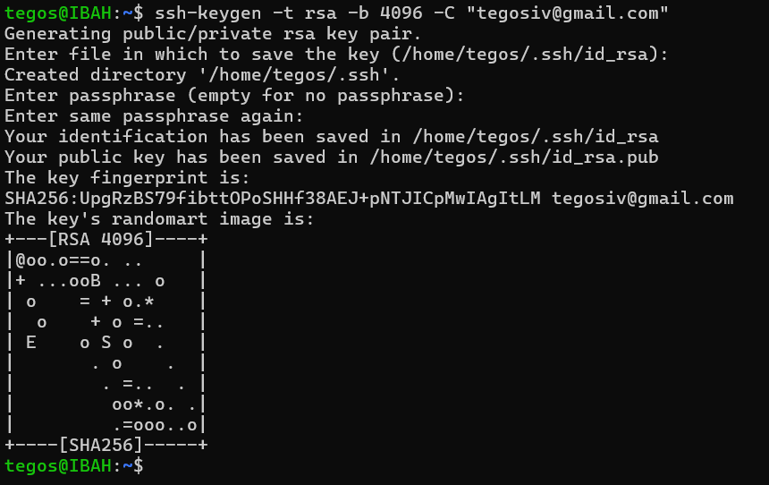
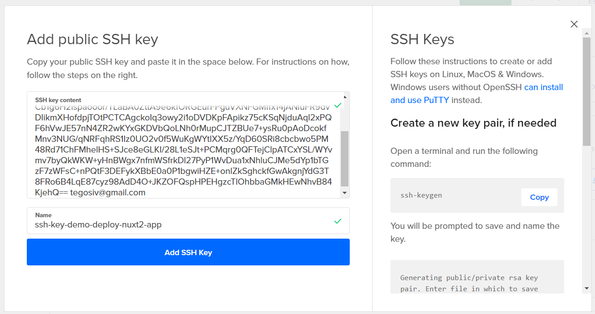
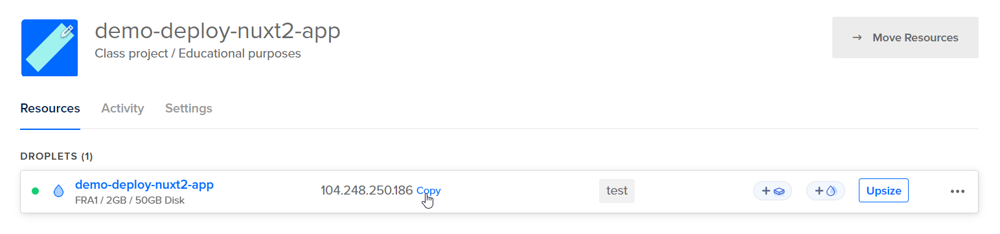
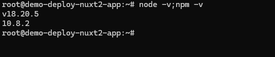
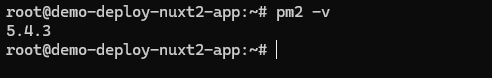
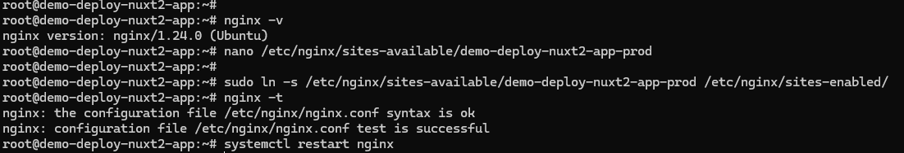

### 3. Setting Up the DigitalOcean Server

Setting up a reliable server is the foundation for a seamless deployment process. Follow these steps to prepare your
DigitalOcean droplet:

#### 3.1 Create a Droplet

1. Log in to your DigitalOcean account and navigate to the **Create** menu.
2. Select **Droplets** and choose **Ubuntu 22/24.04** as the operating system.
3. Select the appropriate plan for your application. A basic plan with 1 GB RAM and 1 vCPU is sufficient for small
   projects. Upgrade as needed for larger applications.
4. Add your SSH key to enable secure access to the server. If you don’t have one, generate an SSH key pair using the
   following command on your local machine:
   ```bash
   ssh-keygen -t rsa -b 4096 -C "your_email@example.com"
   ```
   Add the public key (`~/.ssh/id_rsa.pub`) to your droplet.
   Follow the instruction
   from <a href="https://docs.digitalocean.com/products/droplets/how-to/add-ssh-keys/" target="_blank">How to Add SSH
   Keys to Droplets</a>.
   ```bash
   cat ~/.ssh/id_rsa.pub
   ```
   And copy content.
   
   
5. Finalize and create the droplet. Name your DigitalOcean droplet based on its purpose, environment, and region for
   clarity, such as web-prod-nyc1 or db-staging-ams3. Use short, descriptive, and consistent names to make management
   easier. Avoid generic names like server1 to ensure quick identification. We called our droplet:
   demo-deploy-nuxt2-app. Take note of the droplet’s public IP address.
   

#### 3.2 Secure the Server

After creating the droplet, secure it to prevent unauthorized access:

1. Connect to the droplet using SSH:
   ```bash
   ssh root@your_droplet_ip
   ```
2. Update the system packages:
   ```bash
   apt update && apt upgrade -y
   ```
3. Set up a basic firewall using UFW (Uncomplicated Firewall):
   ```bash
   ufw allow OpenSSH
   ufw enable
   ```
4. Create a dedicated deployment user with sudo privileges:
   ```bash
   adduser deployer
   usermod -aG sudo deployer
   ```
5. Disable root login and password-based authentication for SSH by editing the SSH configuration file:
   ```bash
   nano /etc/ssh/sshd_config
   ```
   Change the following lines:
   ```
   PermitRootLogin no
   PasswordAuthentication no
   ```
   Restart the SSH service:
   ```bash
   systemctl restart ssh
   ```

#### 3.3 Install Node.js and PM2

1. Install Node.js (16 LTS version):
   ```bash
   curl -fsSL https://deb.nodesource.com/setup_18.x | sudo -E bash -
   apt install -y nodejs
   ```
2. Verify the installation:
   ```bash
   node -v
   npm -v
   ```
   
3. Install PM2 globally to manage your Nuxt 2 application:
   ```bash
   npm install -g pm2
   ```
   

4. Install Yarn
   ```bash
   curl -sS https://dl.yarnpkg.com/debian/pubkey.gpg | sudo apt-key add -
   echo "deb https://dl.yarnpkg.com/debian/ stable main" | sudo tee /etc/apt/sources.list.d/yarn.list
   ```
   
   ```bash
   sudo apt update && sudo apt install yarn
   ```

#### 3.4 Install and Configure Nginx

1. Install Nginx:
   ```bash
   apt install nginx -y
   ```
2. Configure Nginx as a reverse proxy for your application. When naming Nginx configuration files, use **lowercase
   letters** and **descriptive names** for clarity, such as `example-site.conf` or `api-backend.conf`. For
   environment-specific files, add suffixes like `-dev`, `-stg`, or `-prod` (e.g., `example-site-prod.conf`). Shared or
   reusable configurations should have clear prefixes like `shared-headers.conf`. Avoid redundancy by omitting terms
   like "nginx" in file names and use `.bak` or `.disabled` for backups or inactive files. We name our config file like:
   demo-deploy-nuxt2-app-prod.
   ```bash
   nano /etc/nginx/sites-available/demo-deploy-nuxt2-app-prod
   ```

   Replace the contents with the following configuration:

   ```nginx
    server {
        listen 80;
        server_name your_domain.com;
        
        # Disable server tokens for security
        server_tokens off;
        
        # Basic security headers
        add_header X-Frame-Options "SAMEORIGIN";
        add_header X-XSS-Protection "1; mode=block";
        add_header X-Content-Type-Options "nosniff";
        
        location / {
            proxy_pass http://localhost:3000;
            proxy_http_version 1.1;
            proxy_set_header Upgrade $http_upgrade;
            proxy_set_header Connection 'upgrade';
            proxy_set_header Host $host;
            proxy_cache_bypass $http_upgrade;
            proxy_set_header X-Real-IP $remote_addr;
            proxy_set_header X-Forwarded-For $proxy_add_x_forwarded_for;
        }
    }
   ```
3. Enable config file, test the configuration and reload Nginx:
   ```bash
   sudo ln -s /etc/nginx/sites-available/demo-deploy-nuxt2-app-prod /etc/nginx/sites-enabled/
   nginx -t
   systemctl restart nginx
   ```
   

Server setup complete! You're now ready to deploy your Nuxt 2 application with enhanced security and performance.