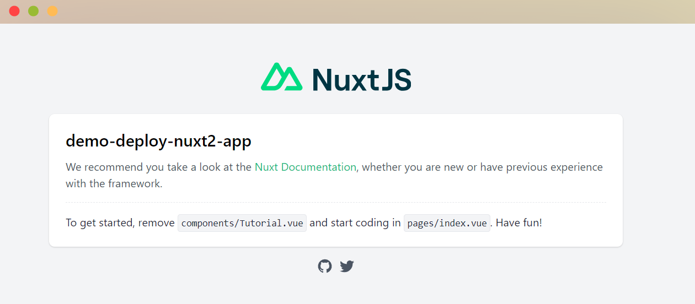
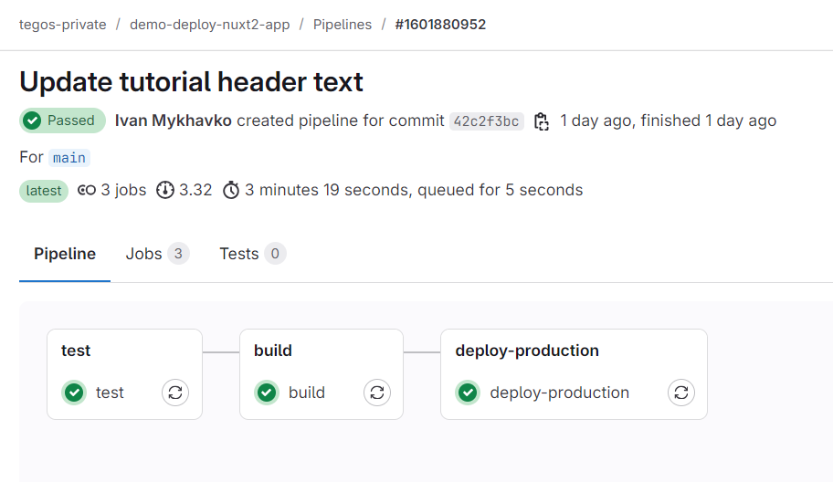

### 6. Results and Repository Access

By following this guide, you now have a fully functional pipeline that automates the deployment of your Nuxt 2
application to a DigitalOcean Droplet using GitLab CI/CD. Here's a quick summary of what we accomplished:

- **Continuous Integration**: Each commit triggers a pipeline that installs dependencies, builds the Nuxt 2 project, and
  runs necessary tests.
- **Continuous Deployment**: Successful builds are deployed automatically to your DigitalOcean Droplet.
- **Reliable Environment**: Your application runs in a secure and scalable production environment.

## Final Results

After deployment, you should observe the following:

1. **Live Application**: Your Nuxt 2 app is accessible via your DigitalOcean server's IP address or domain.
2. **Automated Workflow**: Every push to the main branch seamlessly updates your production environment without manual
   intervention.
3. **Error Logs and Monitoring**: Logs and CI/CD pipelines provide detailed insights for troubleshooting and performance
   tracking.

## Access the Repository

To explore the full configuration files and pipeline setup, you can access the repository here:  
[GitLab Repository Link](https://gitlab.com/tegos/demo-deploy-nuxt2-app)
